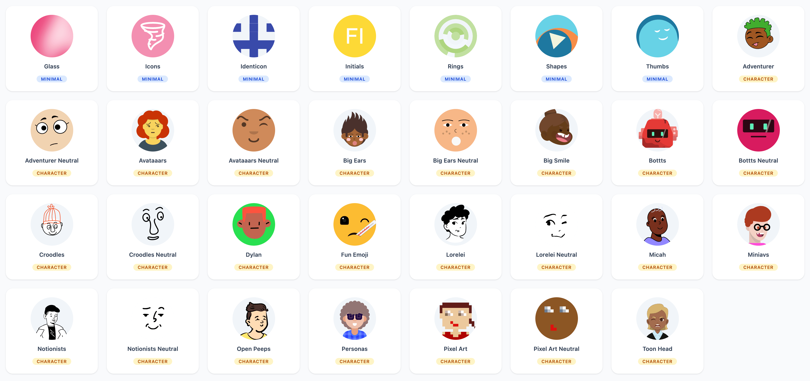

# Filament DiceBear

[](https://packagist.org/packages/leek/filament-dicebear)
[](https://github.com/leek/filament-dicebear/actions?query=workflow%3Arun-tests+branch%3Amain)
[](https://packagist.org/packages/leek/filament-dicebear)

A [DiceBear](https://www.dicebear.com/) avatar provider for [Filament](https://filamentphp.com/) panels. Supports all 31 avatar styles with caching, per-model customization, and self-hosted instances.



## Installation

```bash
composer require leek/filament-dicebear
```

Optionally publish the config file:

```bash
php artisan vendor:publish --tag=filament-dicebear-config
```

## Quick Start

Register the plugin and avatar provider in your panel:

```php
use Leek\FilamentDiceBear\DiceBearPlugin;
use Leek\FilamentDiceBear\DiceBearProvider;
use Leek\FilamentDiceBear\Enums\DiceBearStyle;

class AppPanelProvider extends PanelProvider
{
    public function panel(Panel $panel): Panel
    {
        return $panel
            ->defaultAvatarProvider(DiceBearProvider::class)
            ->plugins([
                DiceBearPlugin::make()
                    ->style(DiceBearStyle::Thumbs),
            ]);
    }
}
```

That's it! All users without a custom avatar will now display a DiceBear avatar.

## Plugin Configuration

All configuration methods are optional and return the plugin instance for fluent chaining.

### Style

Choose from any of the [31 available styles](#available-styles):

```php
DiceBearPlugin::make()
    ->style(DiceBearStyle::Adventurer)
```

You can also pass a string:

```php
DiceBearPlugin::make()
    ->style('bottts-neutral')
```

### Universal Options

These correspond to DiceBear's [universal query parameters](https://www.dicebear.com/how-to-use/http-api/):

```php
DiceBearPlugin::make()
    ->size(128)              // Pixel dimensions
    ->radius(50)             // Corner radius (0-50)
    ->scale(80)              // Scale (0-200)
    ->rotate(45)             // Rotation (0-360)
    ->flip()                 // Mirror horizontally
    ->backgroundColor('ff0000')       // Hex color(s), comma-separated
    ->backgroundType('gradientLinear') // 'solid' or 'gradientLinear'
```

### Style-Specific Options

Pass any style-specific parameters via `options()`:

```php
DiceBearPlugin::make()
    ->style(DiceBearStyle::BotttsNeutral)
    ->options([
        'eyes' => 'bulging,eva,happy,hearts',
        'mouth' => 'diagram,smile01,smile02',
    ])
```

See the [DiceBear docs](https://www.dicebear.com/styles/) for available options per style.

### Seed Resolver

By default, the provider uses the model's `id` as the seed. Customize it:

```php
DiceBearPlugin::make()
    ->seedUsing(fn ($record) => $record->email)
```

### Caching

SVGs are cached to disk by default to avoid repeated API calls:

```php
DiceBearPlugin::make()
    ->cache(true)                    // Enable/disable (default: true)
    ->disk('public')                 // Storage disk (default: 'public')
    ->cachePath('avatars/dicebear')  // Cache directory (default: 'avatars/dicebear')
```

When caching is disabled, the SVG is returned as a base64 data URI.

To clear cached avatars:

```php
Storage::disk('public')->deleteDirectory('avatars/dicebear');
```

### Self-Hosting

For production use or commercial projects, you may want to [self-host DiceBear](https://www.dicebear.com/guides/host-the-http-api-yourself/):

```php
DiceBearPlugin::make()
    ->baseUrl('https://dicebear.example.com')
    ->apiVersion('9.x')
```

## Per-Model Customization

Use the `HasDiceBearAvatar` trait on any model implementing `HasAvatar` to customize avatars per model:

```php
use Filament\Models\Contracts\HasAvatar;
use Leek\FilamentDiceBear\Concerns\HasDiceBearAvatar;
use Leek\FilamentDiceBear\Enums\DiceBearStyle;

class User extends Model implements HasAvatar
{
    use HasDiceBearAvatar;

    public function dicebearAvatarStyle(): DiceBearStyle
    {
        return DiceBearStyle::Thumbs;
    }
}
```

### With Uploaded Photo Fallback

Override `getCustomAvatarUrl()` to check for uploaded photos first:

```php
class User extends Model implements HasAvatar
{
    use HasDiceBearAvatar;

    protected function getCustomAvatarUrl(): ?string
    {
        if ($this->avatar_url) {
            return Storage::url($this->avatar_url);
        }

        return null; // Falls back to DiceBear
    }

    public function dicebearAvatarStyle(): DiceBearStyle
    {
        return DiceBearStyle::Thumbs;
    }
}
```

### With Style-Specific Options

```php
class ClientProfile extends Model implements HasAvatar
{
    use HasDiceBearAvatar;

    public function dicebearAvatarStyle(): DiceBearStyle
    {
        return DiceBearStyle::BotttsNeutral;
    }

    public function dicebearAvatarOptions(): array
    {
        return [
            'eyes' => 'bulging,eva,frame1,frame2,happy,hearts',
            'mouth' => 'diagram,smile01,smile02',
        ];
    }
}
```

## Available Styles

### Minimalist

| Style | Slug | License |
|-------|------|---------|
| Glass | `glass` | CC0 1.0 |
| Icons | `icons` | MIT |
| Identicon | `identicon` | CC0 1.0 |
| Initials | `initials` | CC0 1.0 |
| Rings | `rings` | CC0 1.0 |
| Shapes | `shapes` | CC0 1.0 |
| Thumbs | `thumbs` | CC0 1.0 |

### Characters

| Style | Slug | Creator | License |
|-------|------|---------|---------|
| Adventurer | `adventurer` | Lisa Wischofsky | CC BY 4.0 |
| Adventurer Neutral | `adventurer-neutral` | Lisa Wischofsky | CC BY 4.0 |
| Avataaars | `avataaars` | Pablo Stanley | Free |
| Avataaars Neutral | `avataaars-neutral` | Pablo Stanley | Free |
| Big Ears | `big-ears` | The Visual Team | CC BY 4.0 |
| Big Ears Neutral | `big-ears-neutral` | The Visual Team | CC BY 4.0 |
| Big Smile | `big-smile` | Ashley Seo | CC BY 4.0 |
| Bottts | `bottts` | Pablo Stanley | Free |
| Bottts Neutral | `bottts-neutral` | Pablo Stanley | Free |
| Croodles | `croodles` | vijay verma | CC BY 4.0 |
| Croodles Neutral | `croodles-neutral` | vijay verma | CC BY 4.0 |
| Dylan | `dylan` | Natalia Spivak | CC BY 4.0 |
| Fun Emoji | `fun-emoji` | Davis Uche | CC BY 4.0 |
| Lorelei | `lorelei` | Lisa Wischofsky | CC0 1.0 |
| Lorelei Neutral | `lorelei-neutral` | Lisa Wischofsky | CC0 1.0 |
| Micah | `micah` | Micah Lanier | CC BY 4.0 |
| Miniavs | `miniavs` | Webpixels | CC BY 4.0 |
| Notionists | `notionists` | Zoish | CC0 1.0 |
| Notionists Neutral | `notionists-neutral` | Zoish | CC0 1.0 |
| Open Peeps | `open-peeps` | Pablo Stanley | CC0 1.0 |
| Personas | `personas` | Draftbit | CC BY 4.0 |
| Pixel Art | `pixel-art` | DiceBear | CC0 1.0 |
| Pixel Art Neutral | `pixel-art-neutral` | DiceBear | CC0 1.0 |
| Toon Head | `toon-head` | Johan Melin | CC BY 4.0 |

## Configuration File

```php
// config/filament-dicebear.php
return [
    'style' => 'initials',
    'api_version' => '9.x',
    'base_url' => 'https://api.dicebear.com',
    'size' => null,
    'radius' => null,
    'scale' => null,
    'rotate' => null,
    'flip' => null,
    'background_color' => null,
    'background_type' => null,
    'cache' => [
        'enabled' => true,
        'disk' => 'public',
        'path' => 'avatars/dicebear',
    ],
];
```

## Testing

```bash
composer test
```

## License

The MIT License (MIT). Please see [License File](LICENSE.md) for more information.
