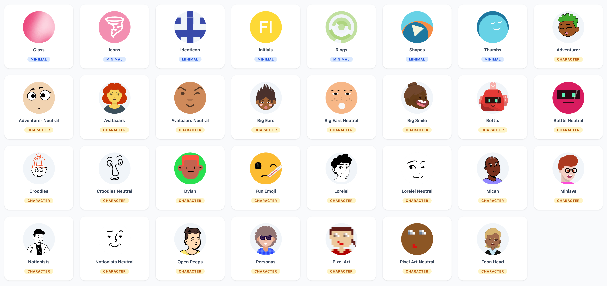

# Filament DiceBear

[](https://packagist.org/packages/leek/filament-dicebear)
[](https://github.com/leek/filament-dicebear/actions?query=workflow%3Arun-tests+branch%3Amain)
[](https://packagist.org/packages/leek/filament-dicebear)

A [DiceBear](https://www.dicebear.com/) v10 avatar provider for [Filament](https://filamentphp.com/) panels. Supports all 61 avatar styles (19 of them animated), renders natively in PHP with no network calls, and adds caching, per-model customization, custom style definitions, and self-hosted API support.



> Upgrading from 1.x? See [UPGRADE.md](UPGRADE.md).

## Installation

```bash
composer require leek/filament-dicebear
```

This pulls in DiceBear's native PHP core ([`dicebear/core`](https://packagist.org/packages/dicebear/core)) and the official style definitions ([`dicebear/styles`](https://packagist.org/packages/dicebear/styles)).

Optionally publish the config file:

```bash
php artisan vendor:publish --tag=filament-dicebear-config
```

## Quick Start

Register the plugin and avatar provider in your panel:

```php
use Leek\FilamentDiceBear\DiceBearPlugin;
use Leek\FilamentDiceBear\DiceBearProvider;
use Leek\FilamentDiceBear\Enums\DiceBearStyle;

class AppPanelProvider extends PanelProvider
{
    public function panel(Panel $panel): Panel
    {
        return $panel
            ->defaultAvatarProvider(DiceBearProvider::class)
            ->plugins([
                DiceBearPlugin::make()
                    ->style(DiceBearStyle::Thumbs)
                    ->animated(),
            ]);
    }
}
```

That's it! All users without a custom avatar will now display a DiceBear avatar.

## Plugin Configuration

All configuration methods are optional and return the plugin instance for fluent chaining.

### Style

Choose from any of the [61 available styles](#available-styles):

```php
DiceBearPlugin::make()
    ->style(DiceBearStyle::Adventurer)
```

You can also pass a string:

```php
DiceBearPlugin::make()
    ->style('bottts-neutral')
```

### Animation

19 styles ship an opt-in animation (marked ✓ in [Available Styles](#available-styles)). It is CSS inside the SVG, so it plays in a plain `` tag and respects `prefers-reduced-motion`.

```php
use Leek\FilamentDiceBear\Enums\AnimationSpeed;

DiceBearPlugin::make()
    ->style(DiceBearStyle::Planets)
    ->animated()                            // Random speed per seed
    ->animationSpeed(AnimationSpeed::Slow)  // Or pin it: Slowest, Slow, Medium, Fast, Fastest, None
```

Styles without an animation are unaffected, so it's safe to enable globally. `DiceBearStyle::Thumbs->isAnimated()` and `DiceBearStyle::animated()` tell you which styles animate.

### Core Options

These map 1:1 to DiceBear's [core options](https://www.dicebear.com/guides/core-options/). Options that take a range accept a fixed value or a `[min, max]` pair that the seed samples from.

```php
DiceBearPlugin::make()
    ->size(128)                  // Pixel dimensions (1–4096)
    ->borderRadius(50)           // Percent of canvas (0–50; 50 = circle)
    ->scale(0.9)                 // Scale factor (0–10; 1 = original)
    ->rotate([-10, 10])          // Degrees (−360–360)
    ->translateX(5)              // Percent of canvas width
    ->translateY(-5)             // Percent of canvas height
    ->flip('horizontal')         // 'none', 'horizontal', 'vertical', 'both' (or true)
    ->tags(['!mood:negative'])   // Variant tag filter
```

### Background

```php
DiceBearPlugin::make()
    ->backgroundColor(['b6e3f4', 'c0aede', 'd1d4f9'])  // Hex, '#' optional
    ->backgroundColorFill('linear')                    // 'solid', 'linear', 'radial'
    ->backgroundColorFillStops(3)                      // Gradient stops (min 2)
    ->backgroundColorAngle([0, 90])                    // Gradient angle
    ->backgroundColorOrder('fixed')                    // Use colors in the given order
```

### Accessibility & Typography

These options work with the local driver and self-hosted APIs. The public HTTP API ignores them.

```php
DiceBearPlugin::make()
    ->title('User avatar')           // Adds role="img" and a <title>
    ->fontFamily(['Inter', 'sans-serif'])  // Text-based styles, e.g. initials
    ->fontWeight(600)
    ->idRandomization()              // Unique SVG ids when inlining several avatars
```

Any other core option can be set by name with `->setCoreOption('name', $value)`.

### Style-Specific Options

Each style exposes per-component and per-color options. Pass them with `options()`:

```php
DiceBearPlugin::make()
    ->style(DiceBearStyle::BotttsNeutral)
    ->options([
        'eyesVariant' => ['bulging', 'eva', 'happy', 'hearts'],
        'mouthVariant' => ['diagram', 'smile01', 'smile02'],
        'mouthProbability' => 80,
    ])
```

- `{component}Variant`: restrict variants. Pass `['short01' => 2, 'long01' => 1]` to weight them (weights are local driver only).
- `{component}Probability`: chance (0–100) that the component appears.
- `{color}Color`, `{color}ColorFill`, `{color}ColorFillStops`, `{color}ColorAngle`, `{color}ColorOrder`: override a palette, e.g. `'skinColor' => ['f2d3b1']`.

Each [style page](https://www.dicebear.com/styles/) lists its options, or fetch `https://api.dicebear.com/10.x/<style>/options.json`.

### Custom Styles

Render your own style from a [DiceBear definition](https://www.dicebear.com/specification/definition-schema/) JSON file (hand-written or exported with the [Figma plugin](https://www.dicebear.com/guides/create-an-avatar-style-with-figma/)):

```php
DiceBearPlugin::make()
    ->customStyle('brand', resource_path('avatars/brand.json'))
```

Or register them in config under `custom_styles` and select them with `->style('brand')`. Custom styles are always rendered locally as SVG.

### Seed Resolver

By default, the provider uses the model's `id` as the seed. Customize it:

```php
DiceBearPlugin::make()
    ->seedUsing(fn ($record) => $record->email)
```

### Rendering Driver

By default, avatars are rendered in-process by DiceBear's native PHP core. There are no network calls or rate limits, every option is supported, and the output is byte-identical to the HTTP API.

To use the [HTTP API](https://www.dicebear.com/how-to-use/http-api/) instead, for example a [self-hosted instance](https://www.dicebear.com/guides/host-the-http-api-yourself/):

```php
DiceBearPlugin::make()
    ->driver('http')
    ->baseUrl('https://dicebear.example.com')
    ->apiVersion('10.x')
```

Raster formats are rendered by the HTTP API automatically:

```php
DiceBearPlugin::make()
    ->format('webp')  // 'svg' (default), 'png', 'jpg', 'webp', 'avif'
```

If rendering fails, the provider falls back to the HTTP API URL. Local failures are passed to `report()`, so invalid options show up in your logs.

### Caching

Rendered avatars are cached to disk by default:

```php
DiceBearPlugin::make()
    ->cache(true)                    // Enable/disable (default: true)
    ->disk('public')                 // Storage disk (default: 'public')
    ->cachePath('avatars/dicebear')  // Cache directory (default: 'avatars/dicebear')
```

Cache filenames hash the options together with the DiceBear core and styles versions (or the API version), so upgrading DiceBear never serves stale avatars. When caching is disabled, the avatar is returned as a base64 data URI.

To clear cached avatars:

```php
Storage::disk('public')->deleteDirectory('avatars/dicebear');
```

## Per-Model Customization

Use the `HasDiceBearAvatar` trait on any model implementing `HasAvatar` to customize avatars per model:

```php
use Filament\Models\Contracts\HasAvatar;
use Leek\FilamentDiceBear\Concerns\HasDiceBearAvatar;
use Leek\FilamentDiceBear\Enums\DiceBearStyle;

class User extends Model implements HasAvatar
{
    use HasDiceBearAvatar;

    public function dicebearAvatarStyle(): DiceBearStyle
    {
        return DiceBearStyle::Thumbs;
    }
}
```

### With Uploaded Photo Fallback

Override `getCustomAvatarUrl()` to check for uploaded photos first:

```php
class User extends Model implements HasAvatar
{
    use HasDiceBearAvatar;

    protected function getCustomAvatarUrl(): ?string
    {
        if ($this->avatar_url) {
            return Storage::url($this->avatar_url);
        }

        return null; // Falls back to DiceBear
    }

    public function dicebearAvatarStyle(): DiceBearStyle
    {
        return DiceBearStyle::Thumbs;
    }
}
```

### With Style-Specific Options

```php
class ClientProfile extends Model implements HasAvatar
{
    use HasDiceBearAvatar;

    public function dicebearAvatarStyle(): DiceBearStyle
    {
        return DiceBearStyle::BotttsNeutral;
    }

    public function dicebearAvatarOptions(): array
    {
        return [
            'eyesVariant' => ['bulging', 'eva', 'frame1', 'frame2', 'happy', 'hearts'],
            'mouthVariant' => ['diagram', 'smile01', 'smile02'],
            'tags' => ['animation'],
        ];
    }
}
```

## Available Styles

Styles are licensed by their creators. See DiceBear's [license overview](https://www.dicebear.com/licenses/).

### Minimalist

| Style | Slug | Animated | Creator | License |
|-------|------|:--------:|---------|---------|
| Blobs | `blobs` | ✓ | DiceBear | CC0 1.0 |
| Disco | `disco` |  | DiceBear | CC0 1.0 |
| Glass | `glass` | ✓ | DiceBear | CC0 1.0 |
| Glyphs | `glyphs` |  | Matt Houser | CC BY 4.0 |
| Icons | `icons` |  | The Bootstrap Authors | MIT |
| Identicon | `identicon` |  | DiceBear | CC0 1.0 |
| Initial Face | `initial-face` | ✓ | DiceBear | CC0 1.0 |
| Initials | `initials` |  | DiceBear | CC0 1.0 |
| Loops | `loops` | ✓ | DiceBear | CC0 1.0 |
| Patchwork | `patchwork` |  | DiceBear | CC0 1.0 |
| Rings | `rings` |  | DiceBear | CC0 1.0 |
| Shape Grid | `shape-grid` |  | DiceBear | CC0 1.0 |
| Shapes | `shapes` | ✓ | DiceBear | CC0 1.0 |
| Slice | `slice` |  | DiceBear | CC0 1.0 |
| Squircles | `squircles` | ✓ | DiceBear | CC0 1.0 |
| Stack | `stack` |  | DiceBear | CC0 1.0 |
| Stripes | `stripes` |  | DiceBear | CC0 1.0 |
| Triangles | `triangles` |  | DiceBear | CC0 1.0 |
| Waves | `waves` | ✓ | DiceBear | CC0 1.0 |
| Weave | `weave` |  | DiceBear | CC0 1.0 |

### Characters

| Style | Slug | Animated | Creator | License |
|-------|------|:--------:|---------|---------|
| Adventurer | `adventurer` |  | Lisa Wischofsky | CC BY 4.0 |
| Adventurer Neutral | `adventurer-neutral` |  | Lisa Wischofsky | CC BY 4.0 |
| Avataaars | `avataaars` |  | Pablo Stanley | Free for personal and commercial use |
| Avataaars Neutral | `avataaars-neutral` |  | Pablo Stanley | Free for personal and commercial use. |
| Big Ears | `big-ears` |  | The Visual Team | CC BY 4.0 |
| Big Ears Neutral | `big-ears-neutral` |  | The Visual Team | CC BY 4.0 |
| Big Smile | `big-smile` |  | Ashley Seo | CC BY 4.0 |
| Bottts | `bottts` |  | Pablo Stanley | Free for personal and commercial use |
| Bottts Neutral | `bottts-neutral` |  | Pablo Stanley | Free for personal and commercial use |
| Cameo | `cameo` |  | DiceBear | CC0 1.0 |
| Clay | `clay` | ✓ | DiceBear | CC0 1.0 |
| Critters | `critters` | ✓ | DiceBear | CC0 1.0 |
| Croodles | `croodles` |  | vijay verma | CC BY 4.0 |
| Croodles Neutral | `croodles-neutral` |  | vijay verma | CC BY 4.0 |
| Cutouts | `cutouts` |  | DiceBear | CC0 1.0 |
| Dylan | `dylan` |  | Natalia Spivak | CC BY 4.0 |
| Fun Emoji | `fun-emoji` |  | Davis Uche | CC BY 4.0 |
| Gaze | `gaze` | ✓ | DiceBear | CC0 1.0 |
| Line Face | `line-face` |  | DiceBear | CC0 1.0 |
| Lorelei | `lorelei` |  | Lisa Wischofsky | CC0 1.0 |
| Lorelei Neutral | `lorelei-neutral` |  | Lisa Wischofsky | CC0 1.0 |
| Marbles | `marbles` |  | DiceBear | CC0 1.0 |
| Micah | `micah` |  | Micah Lanier | CC BY 4.0 |
| Miniavs | `miniavs` |  | Webpixels | CC BY 4.0 |
| Moods | `moods` | ✓ | DiceBear | CC0 1.0 |
| Notionists | `notionists` |  | Zoish | CC0 1.0 |
| Notionists Neutral | `notionists-neutral` |  | Zoish | CC0 1.0 |
| Open Peeps | `open-peeps` |  | Pablo Stanley | CC0 1.0 |
| Personas | `personas` |  | Draftbit - draftbit.com | CC BY 4.0 |
| Pixel Art | `pixel-art` |  | DiceBear | CC0 1.0 |
| Pixel Art Neutral | `pixel-art-neutral` |  | DiceBear | CC0 1.0 |
| Pixelbot | `pixelbot` | ✓ | DiceBear | CC0 1.0 |
| Shadows | `shadows` |  | DiceBear | CC0 1.0 |
| Sprouts | `sprouts` | ✓ | DiceBear | CC0 1.0 |
| Thumbs | `thumbs` | ✓ | DiceBear | CC0 1.0 |
| Toon Head | `toon-head` |  | Johan Melin | CC BY 4.0 |
| Voxel Art | `voxel-art` | ✓ | DiceBear | CC0 1.0 |
| Voxel Bot | `voxel-bot` | ✓ | DiceBear | CC0 1.0 |

### Scenes

| Style | Slug | Animated | Creator | License |
|-------|------|:--------:|---------|---------|
| Constellation | `constellation` | ✓ | DiceBear | CC0 1.0 |
| Landscape | `landscape` | ✓ | DiceBear | CC0 1.0 |
| Planets | `planets` | ✓ | DiceBear | CC0 1.0 |

## Configuration File

```php
// config/filament-dicebear.php
return [
    'driver' => 'local',          // 'local' or 'http'
    'format' => 'svg',            // 'svg', 'png', 'jpg', 'webp', 'avif'
    'style' => 'initials',
    'custom_styles' => [
        // 'brand' => resource_path('avatars/brand.json'),
    ],
    'animation' => [
        'enabled' => false,
        'speed' => null,          // 'none', 'slowest', 'slow', 'medium', 'fast', 'fastest'
    ],
    'options' => [
        // Any core option by its v10 name, e.g. 'size' => 128, 'borderRadius' => 50
    ],
    'api_version' => '10.x',
    'base_url' => 'https://api.dicebear.com',
    'cache' => [
        'enabled' => true,
        'disk' => 'public',
        'path' => 'avatars/dicebear',
    ],
];
```

## Testing

```bash
composer test
```

## More Filament plugins by Leek

**Premium**

- [**Filament UI Plus**](https://filamentphp.com/plugins/leek-ui-plus) — Enhanced UI components: dual sub-navigation, animated sidebar, horizontal-scroll tables, loading bar, and more.
- [**Filament Workflow Engine**](https://filamentphp.com/plugins/leek-workflow-engine) — Automated workflows with a visual builder, triggers/actions, async execution, and audit logging.
- [**Filament Decision Tables**](https://filamentphp.com/plugins/leek-decision-tables) — Business rules engine with spreadsheet-style decision tables.

**Free & open source**

- [**Filament Right Click**](https://github.com/leek/filament-right-click) — Right-click context menus for table rows.
- [**Filament Header Filters**](https://github.com/leek/filament-header-filters) — Inline filters attached to table column headers.
- [**Filament Subtenant Scope**](https://github.com/leek/filament-subtenant-scope) — Second-level tenancy scoping via a topnav dropdown.

## License

The MIT License (MIT). Please see [License File](LICENSE.md) for more information.
